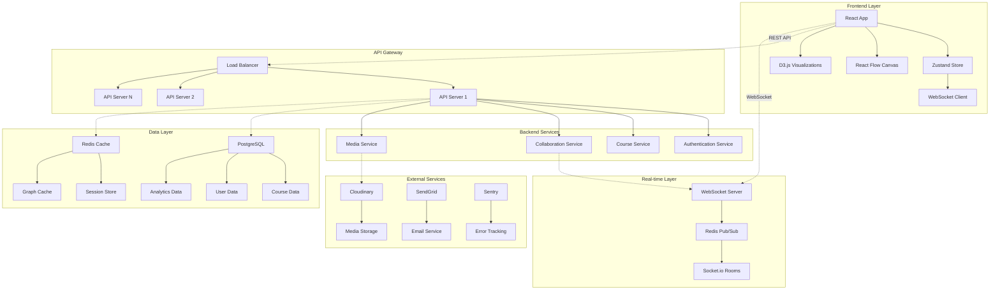

# 🏗️ Архитектурный обзор: Constructure

## 📐 Общая архитектура системы



---

## 🎯 Архитектурные принципы

### 1. Модульность
- **Микросервисная архитектура**: Каждый сервис отвечает за свою область
- **Слабая связанность**: Минимальные зависимости между компонентами
- **Высокая связность**: Логически связанные функции группируются вместе

### 2. Масштабируемость
- **Горизонтальное масштабирование**: Добавление новых серверов
- **Stateless сервисы**: Состояние хранится в базе данных и кэше
- **Load balancing**: Распределение нагрузки между инстансами

### 3. Надежность
- **Circuit Breaker Pattern**: Защита от каскадных сбоев
- **Retry Logic**: Автоматические повторы при сбоях
- **Graceful Degradation**: Работа в условиях частичных сбоев

### 4. Производительность
- **Кэширование**: На всех уровнях архитектуры
- **CDN**: Для статических ресурсов
- **Database Optimization**: Индексы, партиционирование

---

## 🌐 Frontend архитектура

### Компонентная иерархия
```
App
├── AuthProvider
│   ├── LoginPage
│   └── RegisterPage
├── DashboardLayout
│   ├── Header
│   │   ├── UserMenu
│   │   ├── NotificationCenter
│   │   └── SearchBar
│   ├── Sidebar
│   │   ├── CourseList
│   │   ├── RecentProjects
│   │   └── QuickActions
│   └── MainContent
│       ├── CourseGrid
│       └── CourseCard
└── EditorLayout
    ├── EditorHeader
    │   ├── CourseTitle
    │   ├── SaveIndicator
    │   └── ViewModeSelector
    ├── EditorSidebar
    │   ├── NodePalette
    │   ├── LayerPanel
    │   └── HistoryPanel
    ├── Canvas
    │   ├── VisualizationEngine
    │   │   ├── TreeLayout
    │   │   ├── LegoLayout
    │   │   ├── MindMapLayout
    │   │   └── FlowchartLayout
    │   ├── NodeRenderer
    │   │   ├── LessonNode
    │   │   ├── VideoNode
    │   │   ├── QuizNode
    │   │   └── AssignmentNode
    │   └── EdgeRenderer
    └── PropertiesPanel
        ├── NodeProperties
        ├── EdgeProperties
        └── GlobalSettings
```

### State Management Architecture

```typescript
// Главный стор приложения
interface AppState {
  // Аутентификация
  auth: AuthState;
  
  // Курсы
  courses: CoursesState;
  
  // Текущий редактор
  editor: EditorState;
  
  // UI состояние
  ui: UIState;
  
  // Совместная работа
  collaboration: CollaborationState;
}

// Слайсы состояния
interface AuthState {
  user: User | null;
  isAuthenticated: boolean;
  isLoading: boolean;
  error: string | null;
}

interface CoursesState {
  items: Map<string, Course>;
  currentCourse: Course | null;
  isLoading: boolean;
  error: string | null;
  filters: CourseFilters;
}

interface EditorState {
  // Граф данных
  graph: CourseGraph;
  
  // Визуализация
  currentLayout: LayoutType;
  viewport: Viewport;
  
  // Выделение
  selectedNodes: Set<string>;
  selectedEdges: Set<string>;
  
  // История изменений
  history: HistoryStack;
  
  // Режим редактирования
  mode: EditorMode;
}

interface CollaborationState {
  activeUsers: Map<string, CollaboratorCursor>;
  comments: Map<string, Comment>;
  conflicts: Map<string, Conflict>;
  isConnected: boolean;
}
```

### Data Flow Pattern

```typescript
// Unidirectional Data Flow
Action → Reducer → State → UI → Action

// Пример: Добавление узла
const addNodeAction = {
  type: 'ADD_NODE',
  payload: {
    nodeType: 'lesson',
    position: { x: 100, y: 100 },
    properties: {
      title: 'Новый урок',
      description: ''
    }
  }
};

// Reducer обрабатывает действие
const editorReducer = (state: EditorState, action: Action) => {
  switch (action.type) {
    case 'ADD_NODE':
      const newNode = createNode(action.payload);
      return {
        ...state,
        graph: {
          ...state.graph,
          nodes: new Map(state.graph.nodes).set(newNode.id, newNode)
        }
      };
    default:
      return state;
  }
};

// UI реагирует на изменения состояния
const Canvas = () => {
  const nodes = useStore(state => state.editor.graph.nodes);
  const addNode = useStore(state => state.editor.actions.addNode);
  
  return (
    <div>
      {Array.from(nodes.values()).map(node => (
        <NodeComponent key={node.id} node={node} />
      ))}
    </div>
  );
};
```

---

## 🔧 Backend архитектура

### Микросервисная структура

```
services/
├── auth-service/
│   ├── src/
│   │   ├── controllers/
│   │   ├── middleware/
│   │   ├── models/
│   │   └── utils/
│   ├── Dockerfile
│   └── package.json
├── course-service/
│   ├── src/
│   │   ├── controllers/
│   │   │   ├── courseController.ts
│   │   │   ├── nodeController.ts
│   │   │   └── edgeController.ts
│   │   ├── services/
│   │   │   ├── courseService.ts
│   │   │   ├── validationService.ts
│   │   │   └── exportService.ts
│   │   ├── models/
│   │   └── routes/
│   ├── Dockerfile
│   └── package.json
├── collaboration-service/
│   ├── src/
│   │   ├── websocket/
│   │   ├── realtime/
│   │   └── conflict-resolution/
│   ├── Dockerfile
│   └── package.json
├── media-service/
│   ├── src/
│   │   ├── upload/
│   │   ├── processing/
│   │   └── storage/
│   ├── Dockerfile
│   └── package.json
└── analytics-service/
    ├── src/
    │   ├── collectors/
    │   ├── processors/
    │   └── reports/
    ├── Dockerfile
    └── package.json
```

### Service Communication Patterns

#### 1. Синхронное взаимодействие (REST API)
```typescript
// API Gateway роутинг
const routes = {
  '/auth/*': 'auth-service:3001',
  '/courses/*': 'course-service:3002',
  '/media/*': 'media-service:3003',
  '/analytics/*': 'analytics-service:3004'
};

// Circuit Breaker для защиты от сбоев
class CircuitBreaker {
  private failureCount = 0;
  private lastFailure: Date | null = null;
  private state: 'CLOSED' | 'OPEN' | 'HALF_OPEN' = 'CLOSED';
  
  async call<T>(fn: () => Promise<T>): Promise<T> {
    if (this.state === 'OPEN') {
      if (this.shouldAttemptReset()) {
        this.state = 'HALF_OPEN';
      } else {
        throw new Error('Circuit breaker is OPEN');
      }
    }
    
    try {
      const result = await fn();
      this.onSuccess();
      return result;
    } catch (error) {
      this.onFailure();
      throw error;
    }
  }
  
  private onSuccess() {
    this.failureCount = 0;
    this.state = 'CLOSED';
  }
  
  private onFailure() {
    this.failureCount++;
    this.lastFailure = new Date();
    
    if (this.failureCount >= 5) {
      this.state = 'OPEN';
    }
  }
}
```

#### 2. Асинхронное взаимодействие (Events)
```typescript
// Event Bus для межсервисного общения
interface EventBus {
  publish(event: DomainEvent): Promise<void>;
  subscribe<T extends DomainEvent>(
    eventType: string, 
    handler: (event: T) => Promise<void>
  ): void;
}

// События домена
interface CourseCreatedEvent extends DomainEvent {
  type: 'COURSE_CREATED';
  data: {
    courseId: string;
    authorId: string;
    title: string;
    createdAt: Date;
  };
}

interface NodeAddedEvent extends DomainEvent {
  type: 'NODE_ADDED';
  data: {
    courseId: string;
    nodeId: string;
    nodeType: string;
    authorId: string;
  };
}

// Обработчики событий
class AnalyticsService {
  constructor(private eventBus: EventBus) {
    this.eventBus.subscribe('COURSE_CREATED', this.onCourseCreated);
    this.eventBus.subscribe('NODE_ADDED', this.onNodeAdded);
  }
  
  private async onCourseCreated(event: CourseCreatedEvent) {
    await this.trackCourseCreation(event.data);
  }
  
  private async onNodeAdded(event: NodeAddedEvent) {
    await this.trackNodeActivity(event.data);
  }
}
```

---

## 💾 Архитектура данных

### Database Schema Design

```sql
-- Основные таблицы
CREATE TABLE users (
    id UUID PRIMARY KEY DEFAULT gen_random_uuid(),
    email VARCHAR(255) UNIQUE NOT NULL,
    name VARCHAR(255) NOT NULL,
    avatar_url VARCHAR(500),
    role user_role NOT NULL DEFAULT 'teacher',
    created_at TIMESTAMP WITH TIME ZONE DEFAULT NOW(),
    updated_at TIMESTAMP WITH TIME ZONE DEFAULT NOW()
);

CREATE TABLE courses (
    id UUID PRIMARY KEY DEFAULT gen_random_uuid(),
    title VARCHAR(255) NOT NULL,
    description TEXT,
    thumbnail_url VARCHAR(500),
    author_id UUID REFERENCES users(id) ON DELETE CASCADE,
    status course_status NOT NULL DEFAULT 'draft',
    visibility visibility_type NOT NULL DEFAULT 'private',
    tags TEXT[] DEFAULT '{}',
    metadata JSONB DEFAULT '{}',
    graph JSONB NOT NULL DEFAULT '{}',
    version INTEGER DEFAULT 1,
    created_at TIMESTAMP WITH TIME ZONE DEFAULT NOW(),
    updated_at TIMESTAMP WITH TIME ZONE DEFAULT NOW()
);

-- Индексы для производительности
CREATE INDEX idx_courses_author ON courses(author_id);
CREATE INDEX idx_courses_status ON courses(status);
CREATE INDEX idx_courses_tags ON courses USING GIN(tags);
CREATE INDEX idx_courses_graph ON courses USING GIN(graph);

-- Партиционирование для аналитики
CREATE TABLE analytics_events (
    id UUID PRIMARY KEY DEFAULT gen_random_uuid(),
    event_type VARCHAR(50) NOT NULL,
    user_id UUID REFERENCES users(id),
    course_id UUID REFERENCES courses(id),
    data JSONB NOT NULL DEFAULT '{}',
    created_at TIMESTAMP WITH TIME ZONE DEFAULT NOW()
) PARTITION BY RANGE (created_at);

-- Партиции по месяцам
CREATE TABLE analytics_events_2024_01 PARTITION OF analytics_events
    FOR VALUES FROM ('2024-01-01') TO ('2024-02-01');
```

### Кэширование стратегии

```typescript
// Multi-level caching
interface CacheStrategy {
  // L1: In-memory cache (Redis)
  l1: RedisCache;
  
  // L2: Database query cache
  l2: QueryCache;
  
  // L3: CDN cache for static content
  l3: CDNCache;
}

class CourseService {
  async getCourse(courseId: string): Promise<Course> {
    // L1: Проверяем Redis кэш
    const cached = await this.cache.l1.get(`course:${courseId}`);
    if (cached) {
      return JSON.parse(cached);
    }
    
    // L2: Запрос к базе данных
    const course = await this.db.course.findUnique({
      where: { id: courseId },
      include: {
        author: true,
        collaborations: true
      }
    });
    
    if (course) {
      // Кэшируем на 5 минут
      await this.cache.l1.setex(
        `course:${courseId}`, 
        300, 
        JSON.stringify(course)
      );
    }
    
    return course;
  }
  
  async invalidateCourseCache(courseId: string) {
    await this.cache.l1.del(`course:${courseId}`);
    await this.cache.l1.del(`course:${courseId}:*`);
  }
}
```

---

## 🔄 Real-time архитектура

### WebSocket Infrastructure

```typescript
// WebSocket сервер с поддержкой комнат
class CollaborationServer {
  private io: SocketIOServer;
  private redis: Redis;
  
  constructor() {
    this.io = new Server(server, {
      cors: { origin: "*" },
      adapter: createAdapter(this.redis, this.redis.duplicate())
    });
    
    this.setupEventHandlers();
  }
  
  private setupEventHandlers() {
    this.io.on('connection', (socket) => {
      socket.on('join-course', async (data) => {
        await this.handleJoinCourse(socket, data);
      });
      
      socket.on('node-update', async (data) => {
        await this.handleNodeUpdate(socket, data);
      });
      
      socket.on('cursor-move', async (data) => {
        await this.handleCursorMove(socket, data);
      });
    });
  }
  
  private async handleJoinCourse(socket: Socket, data: JoinCourseData) {
    const { courseId, userId } = data;
    
    // Проверяем права доступа
    const hasAccess = await this.checkCourseAccess(userId, courseId);
    if (!hasAccess) {
      socket.emit('error', { message: 'Access denied' });
      return;
    }
    
    // Присоединяемся к комнате курса
    await socket.join(`course:${courseId}`);
    
    // Уведомляем других участников
    socket.to(`course:${courseId}`).emit('user-joined', {
      userId,
      timestamp: new Date()
    });
    
    // Отправляем текущее состояние
    const currentState = await this.getCourseState(courseId);
    socket.emit('course-state', currentState);
  }
  
  private async handleNodeUpdate(socket: Socket, data: NodeUpdateData) {
    const { courseId, nodeId, changes, version } = data;
    
    // Optimistic locking для предотвращения конфликтов
    const conflict = await this.detectConflict(courseId, nodeId, version);
    if (conflict) {
      socket.emit('conflict-detected', conflict);
      return;
    }
    
    // Применяем изменения
    await this.applyNodeChanges(courseId, nodeId, changes);
    
    // Рассылаем изменения другим клиентам
    socket.to(`course:${courseId}`).emit('node-updated', {
      nodeId,
      changes,
      author: socket.userId,
      timestamp: new Date()
    });
  }
}
```

### Conflict Resolution

```typescript
// Operational Transformation для разрешения конфликтов
class OperationalTransform {
  // Трансформация операций для разрешения конфликтов
  transform(op1: Operation, op2: Operation): [Operation, Operation] {
    if (op1.type === 'INSERT' && op2.type === 'INSERT') {
      return this.transformInsertInsert(op1, op2);
    }
    
    if (op1.type === 'DELETE' && op2.type === 'DELETE') {
      return this.transformDeleteDelete(op1, op2);
    }
    
    if (op1.type === 'INSERT' && op2.type === 'DELETE') {
      return this.transformInsertDelete(op1, op2);
    }
    
    // ... другие комбинации
    
    return [op1, op2];
  }
  
  private transformInsertInsert(
    op1: InsertOperation, 
    op2: InsertOperation
  ): [InsertOperation, InsertOperation] {
    if (op1.position <= op2.position) {
      return [
        op1,
        { ...op2, position: op2.position + op1.content.length }
      ];
    } else {
      return [
        { ...op1, position: op1.position + op2.content.length },
        op2
      ];
    }
  }
}

// Система версионирования для отслеживания изменений
class VersionControl {
  async createSnapshot(courseId: string): Promise<Snapshot> {
    const course = await this.getCourse(courseId);
    const snapshot: Snapshot = {
      id: generateId(),
      courseId,
      version: course.version + 1,
      data: course.graph,
      author: this.currentUser.id,
      message: 'Auto-save',
      createdAt: new Date()
    };
    
    await this.saveSnapshot(snapshot);
    return snapshot;
  }
  
  async revertToSnapshot(courseId: string, snapshotId: string): Promise<void> {
    const snapshot = await this.getSnapshot(snapshotId);
    
    await this.updateCourse(courseId, {
      graph: snapshot.data,
      version: snapshot.version
    });
    
    // Уведомляем всех участников об изменении
    this.eventBus.publish({
      type: 'COURSE_REVERTED',
      data: { courseId, snapshotId, revertedBy: this.currentUser.id }
    });
  }
}
```

---

## 🚀 Deployment архитектура

### Containerization Strategy

```dockerfile
# Multi-stage build для оптимизации размера
FROM node:18-alpine AS builder

WORKDIR /app
COPY package*.json ./
RUN npm ci --only=production

COPY . .
RUN npm run build

FROM node:18-alpine AS runtime

# Создаем пользователя без root прав
RUN addgroup -g 1001 -S nodejs
RUN adduser -S nextjs -u 1001

WORKDIR /app

# Копируем только необходимые файлы
COPY --from=builder --chown=nextjs:nodejs /app/dist ./dist
COPY --from=builder --chown=nextjs:nodejs /app/node_modules ./node_modules
COPY --from=builder --chown=nextjs:nodejs /app/package.json ./package.json

USER nextjs

EXPOSE 3000

HEALTHCHECK --interval=30s --timeout=3s --start-period=5s --retries=3 \
  CMD curl -f http://localhost:3000/health || exit 1

CMD ["node", "dist/index.js"]
```

### Kubernetes Deployment

```yaml
# Deployment для API сервиса
apiVersion: apps/v1
kind: Deployment
metadata:
  name: constructure-api
  namespace: constructure
spec:
  replicas: 3
  selector:
    matchLabels:
      app: constructure-api
  template:
    metadata:
      labels:
        app: constructure-api
    spec:
      containers:
      - name: api
        image: constructure/api:latest
        ports:
        - containerPort: 3000
        env:
        - name: DATABASE_URL
          valueFrom:
            secretKeyRef:
              name: db-credentials
              key: url
        - name: REDIS_URL
          valueFrom:
            configMapKeyRef:
              name: app-config
              key: redis-url
        resources:
          requests:
            memory: "256Mi"
            cpu: "200m"
          limits:
            memory: "512Mi"
            cpu: "500m"
        livenessProbe:
          httpGet:
            path: /health
            port: 3000
          initialDelaySeconds: 30
          periodSeconds: 10
        readinessProbe:
          httpGet:
            path: /ready
            port: 3000
          initialDelaySeconds: 5
          periodSeconds: 5
---
# Horizontal Pod Autoscaler
apiVersion: autoscaling/v2
kind: HorizontalPodAutoscaler
metadata:
  name: constructure-api-hpa
  namespace: constructure
spec:
  scaleTargetRef:
    apiVersion: apps/v1
    kind: Deployment
    name: constructure-api
  minReplicas: 3
  maxReplicas: 10
  metrics:
  - type: Resource
    resource:
      name: cpu
      target:
        type: Utilization
        averageUtilization: 70
  - type: Resource
    resource:
      name: memory
      target:
        type: Utilization
        averageUtilization: 80
```

### Infrastructure as Code (Terraform)

```hcl
# main.tf
provider "aws" {
  region = var.aws_region
}

# VPC для изоляции сети
module "vpc" {
  source = "terraform-aws-modules/vpc/aws"
  
  name = "constructure-vpc"
  cidr = "10.0.0.0/16"
  
  azs             = ["${var.aws_region}a", "${var.aws_region}b", "${var.aws_region}c"]
  private_subnets = ["10.0.1.0/24", "10.0.2.0/24", "10.0.3.0/24"]
  public_subnets  = ["10.0.101.0/24", "10.0.102.0/24", "10.0.103.0/24"]
  
  enable_nat_gateway = true
  enable_vpn_gateway = true
  
  tags = {
    Environment = var.environment
    Project     = "constructure"
  }
}

# EKS кластер для контейнеров
module "eks" {
  source = "terraform-aws-modules/eks/aws"
  
  cluster_name    = "constructure-${var.environment}"
  cluster_version = "1.24"
  
  vpc_id     = module.vpc.vpc_id
  subnet_ids = module.vpc.private_subnets
  
  node_groups = {
    main = {
      desired_capacity = 3
      max_capacity     = 10
      min_capacity     = 3
      
      instance_types = ["t3.medium"]
      
      k8s_labels = {
        Environment = var.environment
        Application = "constructure"
      }
    }
  }
}

# RDS для PostgreSQL
resource "aws_db_instance" "postgres" {
  identifier = "constructure-${var.environment}"
  
  engine         = "postgres"
  engine_version = "14.6"
  instance_class = "db.t3.micro"
  
  allocated_storage     = 20
  max_allocated_storage = 100
  storage_encrypted     = true
  
  db_name  = "constructure"
  username = var.db_username
  password = var.db_password
  
  vpc_security_group_ids = [aws_security_group.database.id]
  db_subnet_group_name   = aws_db_subnet_group.main.name
  
  backup_retention_period = 7
  backup_window          = "03:00-04:00"
  maintenance_window     = "sun:04:00-sun:05:00"
  
  skip_final_snapshot = var.environment != "production"
  
  tags = {
    Environment = var.environment
    Project     = "constructure"
  }
}

# ElastiCache для Redis
resource "aws_elasticache_subnet_group" "main" {
  name       = "constructure-${var.environment}"
  subnet_ids = module.vpc.private_subnets
}

resource "aws_elasticache_replication_group" "redis" {
  replication_group_id       = "constructure-${var.environment}"
  description                = "Redis cluster for Constructure"
  
  node_type                  = "cache.t3.micro"
  port                       = 6379
  parameter_group_name       = "default.redis6.x"
  
  num_cache_clusters         = 2
  
  subnet_group_name          = aws_elasticache_subnet_group.main.name
  security_group_ids         = [aws_security_group.redis.id]
  
  at_rest_encryption_enabled = true
  transit_encryption_enabled = true
  
  tags = {
    Environment = var.environment
    Project     = "constructure"
  }
}
```

---

## 📊 Мониторинг и наблюдаемость

### Метрики и алерты

```typescript
// Prometheus метрики
import { register, Counter, Histogram, Gauge } from 'prom-client';

export const metrics = {
  // Счетчики запросов
  httpRequests: new Counter({
    name: 'http_requests_total',
    help: 'Total number of HTTP requests',
    labelNames: ['method', 'route', 'status_code']
  }),
  
  // Время отклика
  httpDuration: new Histogram({
    name: 'http_request_duration_seconds',
    help: 'Duration of HTTP requests in seconds',
    labelNames: ['method', 'route'],
    buckets: [0.1, 0.5, 1, 2, 5]
  }),
  
  // Активные соединения WebSocket
  wsConnections: new Gauge({
    name: 'websocket_connections_active',
    help: 'Number of active WebSocket connections',
    labelNames: ['course_id']
  }),
  
  // Размер кэша
  cacheSize: new Gauge({
    name: 'cache_size_bytes',
    help: 'Size of cache in bytes',
    labelNames: ['cache_type']
  })
};

// Middleware для сбора метрик
export const metricsMiddleware = (req: Request, res: Response, next: NextFunction) => {
  const start = Date.now();
  
  res.on('finish', () => {
    const duration = (Date.now() - start) / 1000;
    
    metrics.httpRequests.inc({
      method: req.method,
      route: req.route?.path || req.path,
      status_code: res.statusCode.toString()
    });
    
    metrics.httpDuration.observe(
      {
        method: req.method,
        route: req.route?.path || req.path
      },
      duration
    );
  });
  
  next();
};
```

### Distributed Tracing

```typescript
// OpenTelemetry для трассировки
import { NodeSDK } from '@opentelemetry/sdk-node';
import { getNodeAutoInstrumentations } from '@opentelemetry/auto-instrumentations-node';
import { JaegerExporter } from '@opentelemetry/exporter-jaeger';

const sdk = new NodeSDK({
  traceExporter: new JaegerExporter({
    endpoint: process.env.JAEGER_ENDPOINT,
  }),
  instrumentations: [getNodeAutoInstrumentations()]
});

sdk.start();

// Кастомные спаны
import { trace } from '@opentelemetry/api';

class CourseService {
  private tracer = trace.getTracer('course-service');
  
  async createCourse(data: CreateCourseData): Promise<Course> {
    return this.tracer.startActiveSpan('course.create', async (span) => {
      try {
        span.setAttributes({
          'course.title': data.title,
          'course.author_id': data.authorId,
          'course.type': data.type
        });
        
        const course = await this.db.course.create({ data });
        
        span.setAttributes({
          'course.id': course.id,
          'course.created': true
        });
        
        return course;
      } catch (error) {
        span.recordException(error);
        span.setStatus({ code: SpanStatusCode.ERROR });
        throw error;
      } finally {
        span.end();
      }
    });
  }
}
```

Эта архитектура обеспечивает масштабируемость, надежность и производительность системы, а также готовность к росту и изменениям требований. 